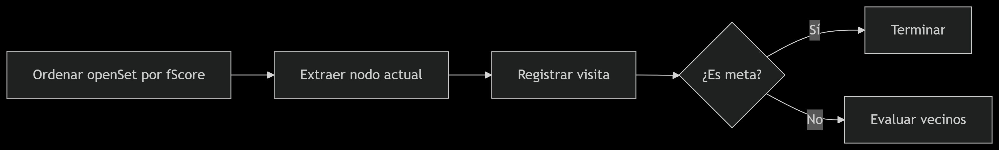

# IA1_1S2025_P3_G16
Repositorio creado para el proyecto 3 de Inteligencia Artificial

## Integrantes
|Nombre | Carnet|
|------|--------|
| Marco Antonio Solis Gonzalez | 202003220 |
| Max Rodrigo Durán Canteo | 201902219 |
| Luis Mariano Moreira Garcia | 202010770 |


# MANUAL DE USUARIO
**Pagina Principal**
Esta es la vista principal

Aca podremos seleccionar las siguientes opciones
1. Cargar Json
2. Seleccionar Algoritmo

**Cargar Json**: Nos mostrara una ventana emergente para elegir un archivo json a cargar 

El archivo json debera de tener el siguiente formato:
```
{
  "ancho": 5,
  "alto": 5,
  "inicio": [0, 0],
  "fin": [4, 4],
  "paredes": [
    [0, 4],
    [1, 0],
    [1, 1],
    [1, 2],
    [2, 4],
    [3, 1],
    [3, 2],
    [3, 3],
    [3, 4]
  ]
}
```
**Seleccionar Algoritmo**: 
En la esquina superior derecha encontraremos el siguiente listado de opciones:

Luego darle click al boton de "Cambiar algoritmo" Aplicara otro metodo de busqueda


**Resolucion del Laberinto**
Una vez cargado el archivo json y establecido el algoritmo con el que resolveremos el laberinto nos mostrara el tablero principal segun el archivo de entrada.


**Botones "<" ">"**
Se cuenta con dos botones uno para avanzar y otro para retroceder los cuales se encuentran en la parte inferior de la pantalla.

Al seleccionar ">" avanzará.


Al seleccionar "<" retrocederá.


**Controles de vista**
En la esquina superior derecha se encuentra controles para manejar la vista de la camara.


Esto para tener un mejor movimiento de la camara


# MANUAL TECNICO 

## Descripción General

Este proyecto implementa una simulación interactiva en 3D usando Three.js para representar y resolver laberintos mediante distintos algoritmos de búsqueda. Se visualiza un modelo moviéndose a lo largo del camino resuelto y se proporciona control total sobre el avance paso a paso y la vista de la cámara.

---

## Estructura de Archivos

### `index.html`

Archivo base que contiene la interfaz de usuario y estructura HTML general del proyecto.

**Componentes clave:**
- **Selector de algoritmo** (`<select>`): permite elegir entre BFS, DFS, A* o variantes.
- **Botones de control**:
  - `Cargar JSON`: carga un archivo de entrada con el laberinto.
  - `Cambiar algoritmo`: ejecuta el algoritmo seleccionado.
  - Botones `>` y `<`: permiten avanzar o retroceder en la solución.
- **Controles de cámara**: botones tipo cruceta (`↑ ↓ ← → •`) que ajustan la posición de la cámara en el eje Z o reinician la vista.

### `index.js`

Archivo principal de control del renderizado, animación y lógica de movimiento.

**Características destacadas:**

- **Inicialización de Three.js**:
  - Se crean `scene`, `camera` y `renderer`.
  - Se agregan luces `AmbientLight` y `DirectionalLight`.

- **Carga de Modelos GLTF** con `GLTFLoader`:
  - `car.glb`: agente móvil.
  - `cityWall2.glb`: paredes del laberinto.
  - `stoneWall.glb`: decoraciones de terreno.
  - `building.glb`: decoraciones en esquinas.
  - Colores y materiales se ajustan al clonar el modelo para evitar efectos globales.

- **`cargarTablero(json)`**:
  - Dibuja el tablero usando `PlaneGeometry` y materiales planos.
  - Añade modelos 3D como paredes y caminos según el JSON.
  - Calcula las posiciones iniciales y finales del agente.
  - Coloca obstáculos y edificios.

- **`cargarSuelo(json, ocupados)`**:
  - Pinta el suelo con modelos `stoneWall.glb` en áreas no ocupadas.

- **Animación del modelo** (`render`):
  - Movimiento suave con interpolación (`moveTowards`).
  - Rotación automática en la dirección del desplazamiento usando `Math.atan2`.

- **Controles del movimiento**:
  - Botones de avance (`>`), retroceso (`<`) y selector de algoritmo (`Cambiar algoritmo`).

- **Controles de cámara**:
  - Botones `camUp`, `camDown`, `camLeft`, `camRight`, `camReset` para ajustar posición.

---

### `graph.js`

Archivo que contiene la lógica de los algoritmos de búsqueda sobre grafos.

**Estructura del grafo**:
- Representado como objeto de adyacencias.
- `addVertex(vertex)` y `addEdge(vertex1, vertex2)` agregan nodos y conexiones.
- `buildFromGrid(mapa)` convierte el JSON en nodos de grafo conectados.

**Algoritmos implementados:**

#### 1. `bfs(start, goal)`
- Búsqueda por amplitud.
- Encuentra el camino más corto (en pasos).
- Devuelve:
  - `path`: camino final.
  - `explorados`: nodos visitados durante el recorrido.

#### 2. `dfs(start, goal)`
- Búsqueda en profundidad recursiva.
- Explora lo más profundo posible antes de retroceder.
- Devuelve:
  - `steps`: lista de pasos realizados, incluyendo retrocesos y nodos visitados.
  - `path`: ruta encontrada a la meta.

#### 3. `dijkstra(start, goal)`
- Búsqueda óptima basada en coste acumulado.
- Usa `distancia` como criterio de prioridad.
- `dijkstraConRegresos` simula retrocesos para visualización.

#### 4. `aStar(start, goal)`
- Usa una heurística de distancia Manhattan.
- Optimiza camino y exploración.
- `aStarConRegresos` incluye pasos retrocedidos para visualizar el recorrido completo.

**Estructura de retorno para DFS, Dijkstra y A\* (con regresos):**
```json
[
  { "tipo": "visita", "valor": [x, y] },
  { "tipo": "meta", "valor": [x, y] },
  { "tipo": "retroceso", "valor": [x, y] }
]
```

---

## Flujo General del Proyecto

1. **Cargar JSON** → genera el tablero 3D con celdas, paredes y caminos.
2. **Seleccionar algoritmo** → se ejecuta BFS, DFS, A*, etc. para resolver.
3. **Visualizar solución** → se usa el modelo 3D como agente móvil.
4. **Controlar avance** → con botones `<` y `>`.
5. **Manipular cámara** → con flechas `↑ ↓ ← →` y botón de reinicio.

---

## Requisitos Técnicos

- Navegador moderno (Chrome, Firefox, Edge).
- Conexión a internet para usar CDN de Three.js.

**Librerías utilizadas:**
- [Three.js](https://threejs.org/) v0.138.0
- GLTFLoader (cargador de modelos `.glb`)

---

## Consideraciones Finales

- Todos los modelos `.glb` se clonan antes de su uso para evitar modificar el original.
- Los materiales también se clonan antes de cambiar color para prevenir efectos colaterales.
- Se pueden agregar nuevos algoritmos fácilmente extendiendo `graph.js`.

# Análisis del Algoritmo BFS (Breadth-First Search)

## 📌 Propósito
Implementa búsqueda en amplitud para encontrar un camino desde un nodo inicial (`start`) hasta un objetivo (`goal`), registrando:
- Todos los nodos visitados
- Movimientos de retroceso cuando no hay caminos disponibles

## 🧠 Estructuras Clave
| Estructura      | Tipo         | Función                                                                 |
|-----------------|--------------|-------------------------------------------------------------------------|
| `visited`       | `Set`        | Evita reprocesamiento de nodos ya explorados                            |
| `queue`         | Array (FIFO) | Almacena caminos potenciales (arrays de nodos) a expandir              |
| `pasos`         | Array        | Registro histórico de todos los movimientos (incluyendo retrocesos)    |

## 🔄 Flujo del Algoritmo
1. **Inicialización**  
   ```javascript
   queue = [[start]]  // Camino inicial: sólo el nodo origen
   pasos = []         // Registro vacío


##  ¿Por qué elegir BFS?

### 1. Encuentra el camino más corto (en cantidad de pasos)

Si todos los movimientos tienen el mismo costo, **BFS garantiza encontrar el camino más corto** desde el nodo de inicio hasta el objetivo.

> Ideal en laberintos, mapas en cuadrícula, o entornos donde el costo de moverse entre nodos es constante.

### 2. Recorrido sistemático

Explora todos los nodos vecinos antes de ir más profundo. Esto es útil cuando:

- Se desea explorar **áreas cercanas primero**.
- Se quieren **todos los caminos más cortos** desde un nodo origen.

### 3. Simple de implementar

Usa estructuras simples como una **cola (queue)** y un conjunto de nodos visitados. Muy eficiente en grafos pequeños o moderados.

---


# Algoritmo A* (A Estrella) con Heurística Manhattan


Donde:
- `g(n)` = coste real desde el inicio hasta el nodo `n`.
- `h(n)` = heurística: estimación del coste desde `n` hasta la meta.
- `f(n)` = coste total estimado del camino pasando por `n`.

---

## ⚙️ Funcionamiento del algoritmo A*

1. **Inicializa** el nodo de inicio en un conjunto abierto (`openSet`).
2. **Calcula**:
   - `gScore` (coste real desde el inicio)
   - `fScore` (coste total estimado con heurística)
3. **Selecciona** el nodo con menor `fScore` para explorar.
4. **Evalúa** cada vecino:
   - Si se encuentra un camino mejor hacia él, se actualiza su `gScore`, `fScore` y `cameFrom`.
5. **Repite** hasta alcanzar la meta o agotar los nodos.

---

## 🧮 Heurística usada

Usamos la **distancia Manhattan** como función heurística:

```js
heuristic(a, b) {
    const [x1, y1] = a.split(',').map(Number);
    const [x2, y2] = b.split(',').map(Number);
    return Math.abs(x1 - x2) + Math.abs(y1 - y2);
}
```





# Documentación Técnica: Algoritmo de Dijkstra

## Descripción General

El algoritmo de Dijkstra es una técnica clásica utilizada para encontrar el camino más corto desde un nodo origen (`start`) a un nodo destino (`goal`) en un grafo ponderado. En esta implementación, se asume un peso uniforme entre los nodos.

---

## Propósito

- Determinar el camino más corto desde el nodo de inicio hasta el nodo objetivo.
- Registrar todos los nodos visitados durante la ejecución del algoritmo.

---

## Pseudocódigo

```plaintext
función dijkstra(start, goal):
    crear diccionario distances con start = 0
    crear conjunto visited
    crear diccionario cameFrom
    crear cola con start
    lista nodosVisitados vacía

    mientras la cola no esté vacía:
        ordenar cola por menor distancia en distances
        extraer el nodo actual

        si ya fue visitado, continuar
        marcar como visitado y agregar a nodosVisitados

        si current es igual a goal:
            retornar nodosVisitados como lista de coordenadas

        para cada vecino del nodo actual:
            calcular distancia tentativa como distancia actual + 1

            si es menor que la distancia conocida:
                actualizar distances y cameFrom
                agregar vecino a la cola

    retornar nodosVisitados como lista de coordenadas
```

---

## Código JavaScript

```javascript
dijkstra(start, goal) {
    const distances = { [start]: 0 };
    const visited = new Set();
    const cameFrom = {};
    const queue = [start];
    const nodosVisitados = [];

    console.log(`Iniciando Dijkstra desde ${start} hasta ${goal}`);

    while (queue.length > 0) {
        queue.sort((a, b) => (distances[a] ?? Infinity) - (distances[b] ?? Infinity));
        const current = queue.shift();

        if (visited.has(current)) continue;
        visited.add(current);
        nodosVisitados.push(current);
        console.log(`Explorando nodo: ${current}, distancia: ${distances[current]}`);

        if (current === goal) {
            console.log("Meta alcanzada");
            return nodosVisitados.map(coord => coord.split(',').map(Number));
        }

        for (let neighbor of this.adjacency[current] || []) {
            const tentative = (distances[current] ?? Infinity) + 1;
            console.log(`  Evaluando vecino: ${neighbor}, distancia tentativa: ${tentative}`);

            if (tentative < (distances[neighbor] ?? Infinity)) {
                distances[neighbor] = tentative;
                cameFrom[neighbor] = current;
                queue.push(neighbor);
                console.log(`  → Distancia actualizada. Nuevo valor: ${tentative}`);
            }
        }
    }

    console.log("No se encontró un camino");
    return nodosVisitados.map(coord => coord.split(',').map(Number));
}
```

---

## Detalles de Implementación

- `distances`: mantiene la distancia más corta conocida desde el nodo de inicio hasta cada nodo.
- `visited`: conjunto de nodos ya explorados para evitar ciclos.
- `cameFrom`: mapa de retroceso que puede ser usado para reconstruir el camino (aunque no se utiliza en el retorno actual).
- `queue`: se comporta como una cola de prioridad, ordenada según la menor distancia acumulada.
- `nodosVisitados`: lista secuencial de nodos explorados, útil para animaciones o visualizaciones.

---

## Resultado

Devuelve una lista de coordenadas de los nodos visitados desde el inicio hasta alcanzar el destino o hasta que no haya más nodos por explorar.


